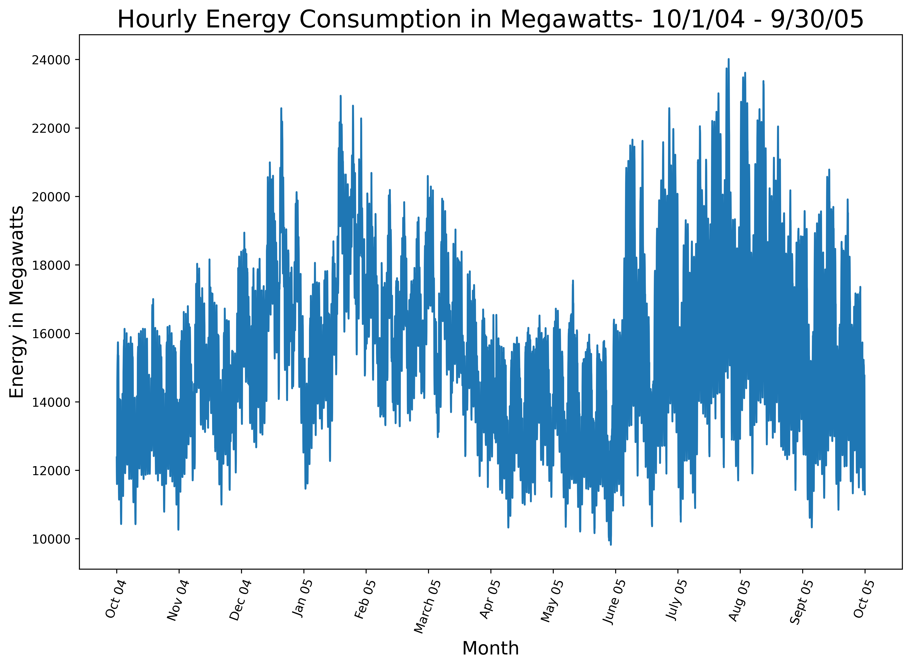
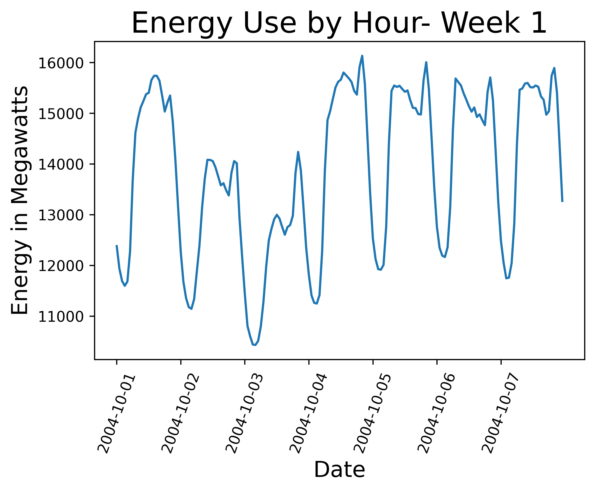
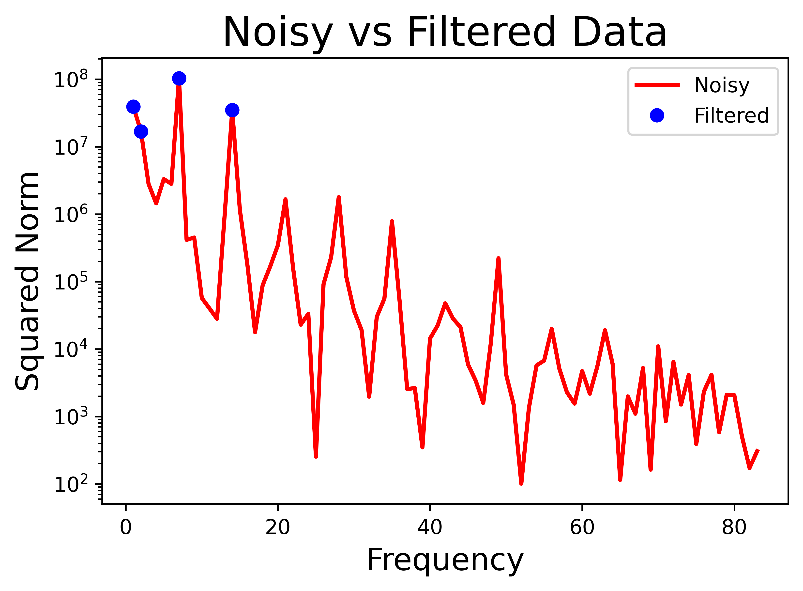

# Repo Overview
This repo contains code that goes along with a [Medium article](https://nathaniel-lanier.medium.com/fourier-transforms-for-detecting-seasonality-and-feature-engineering-5a91fbfe6e7c).  The code demonstrates a technique that uses the Discrete Fourier Transform to detect seasonality in time series data and generate features after filtering out unnecessary  noise.  Among other things this technique could be used in a model to forecast future trends.  Please see the Medium article for a detailed walk through of the technique and an explanation of the code.  Comments and docstrings have been provided in the code as well.  

### Language, Packages, Data and Resources
**Language:**  Python verion 3.8.3    
**Packages:** pandas, numpy, matplotlib, sklearn  
**Data:** https://www.kaggle.com/robikscube/hourly-energy-consumption?select=AEP_hourly.csv  
**Resources:** http://databookuw.com/ & [Steve Brunton Youtube Channel](https://www.youtube.com/channel/UCm5mt-A4w61lknZ9lCsZtBw)

### Visualizations

Below are a few selections of plots that can be seen in the notebook.  

This is a plot of hourly energy consumption from American Electric Power for one year.  There are obvious trends in the data but parsing the trends visually is difficult.  

  

Above is one week of data.  We will use the Discrete Fourier Transform to remove the noise and plot the most consequential frequencies.  

The data plotted in the frequency domain can be seen above.  The blue points represent frequencies that we keep after filtering out everything below 1e7.

These are the two most interpretable frequencies.  The lower frequency wave shows a low point around Tuesday and a high around Friday(Day1 is a Sunday). It can also be seen that there is a daily low point just after midnight everyday and a high point in the afternoon.

This plot shows the filtered data superimposed over the noisy data.  They are quite similar considering we filtered out over 95% of the signal.  This technique could be used to predict future trends because it allows us to filter out non repeating, one-time fluctuations in the data and find the patterns that are cyclical.

Please see the article linked above for more detail!   
